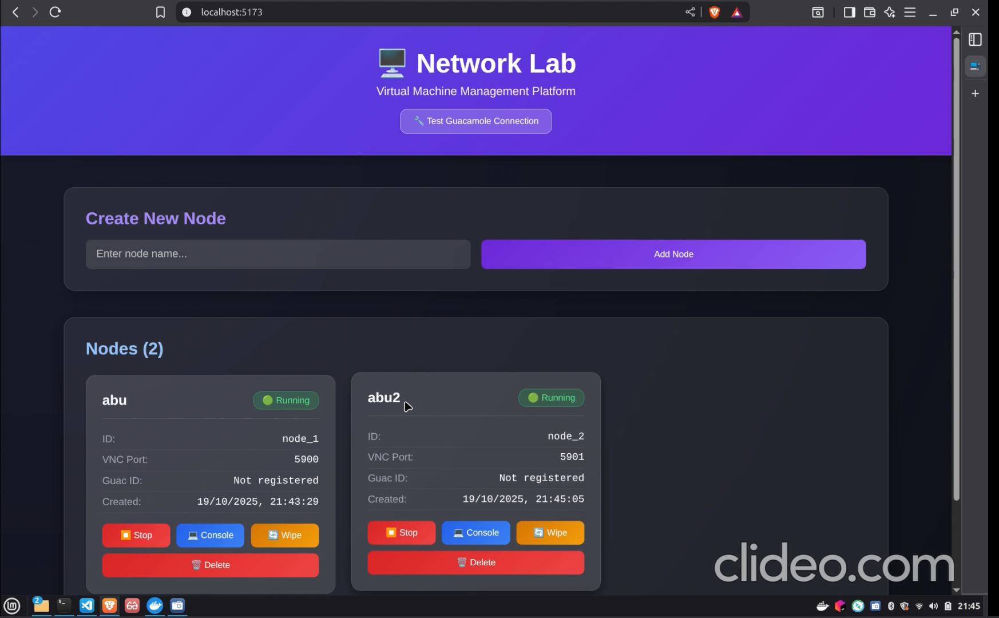

# QEMULAB: A Web-Based Virtual Machine Management Platform

QEMULAB is a full-stack application designed to create, manage, and interact with QEMU-based virtual machines through a simple web interface. It leverages QEMU's efficient qcow2 overlay system for disk management and integrates with Apache Guacamole to provide seamless, in-browser console access to the virtual nodes.

## 📹 Project Demo

<!-- Replace the URL below with your video link (YouTube, Vimeo, or direct link to GIF/MP4) -->
## Project Demo

[](https://drive.google.com/file/d/1zQjYbwlrsjynqwyuKtwg6bGdudNBOqnj/view?usp=sharing)

*Click the thumbnail above to watch the full project demonstration video on Google Drive.*
<!-- OR for a GIF, use this format: -->
<!--  -->

*A demonstration of creating, running, console access, stopping, and deletion of a virtual node.*

## ✨ Features

- **Complete VM Lifecycle Management**: Create, run, stop, wipe, and delete virtual nodes via a clean user interface.
- **Efficient Disk Storage**: Utilizes QEMU's qcow2 copy-on-write overlays, where each VM only stores its changes from a central base image, saving significant disk space.
- **Integrated Web Console**: Access the graphical console of any running VM directly from the browser, powered by an integrated Apache Guacamole stack.
- **Concurrent Operations**: Designed to run and manage multiple isolated virtual machines simultaneously.
- **Containerized Architecture**: The entire application stack (Frontend, Backend, Guacamole, Database) is managed with Docker Compose for simplified setup and consistent deployment.

## 🏗️ Architecture

The platform consists of several key services orchestrated by Docker Compose:

- **Frontend**: A React application that serves as the user's control panel. It communicates with the backend via a REST API to manage the nodes.
- **Backend**: A Node.js (Express) server that exposes API endpoints for the VM lifecycle. It executes `qemu-img` and `qemu-system-*` commands to manage the virtual machines.
- **QEMU**: The core hypervisor responsible for running the VMs. It is installed within the backend service's container.
- **Guacamole Stack**:
  - **guacamole**: The web client that provides the browser-based terminal access.
  - **guacd**: The native proxy that translates between the web client and the VM's VNC server.
  - **postgres**: A PostgreSQL database used by Guacamole to store its connection configurations.

## 🛠️ Tech Stack

| Component | Technology |
|-----------|-----------|
| Frontend | React.js |
| Backend | Node.js, Express.js |
| Virtualization | QEMU, KVM |
| Remote Access | Apache Guacamole, VNC |
| Database | PostgreSQL |
| Containerization | Docker, Docker Compose |

## 🚀 Getting Started

Follow these instructions to set up and run the project locally.

### Prerequisites

- Docker and Docker Compose must be installed.
- A **Base QCOW2 Image**: You need a base OS disk image from which to create your VM overlays.

### 1. Clone the Repository

```bash
git clone https://github.com/aadithyaa9/QEMULAB.git
cd QEMULAB
```

### 2. Create the Base Image

This is a critical setup step. The application expects a base disk image located at `images/base.qcow2`.

Create the `images` directory if it doesn't exist:

```bash
mkdir -p images
```

Place your `base.qcow2` file inside the `images` directory. You can create your own or download a pre-built cloud image.

**Example using a downloaded cloud image (e.g., Ubuntu):**

```bash
# Download an official cloud image
wget https://cloud-images.ubuntu.com/jammy/current/jammy-server-cloudimg-amd64.img

# Rename and move it to the correct location
mv jammy-server-cloudimg-amd64.img images/base.qcow2
```

### 3. Run the Application

The entire stack is defined in the `docker-compose.yml` file. Run the following command from the project root to build and start all services:

```bash
docker-compose up --build -d
```

This command will:
- Build the frontend and backend Docker images.
- Pull the required images for postgres and guacamole.
- Start all services in detached mode.

## 📖 How to Use

1. **Access the Frontend**: Open your web browser and navigate to `http://localhost:80`.

2. **Create a Node**: In the UI, enter a name for your virtual machine and click "Add Node". This will create a new qcow2 overlay file for the VM.

3. **Run the Node**: Click the "Run" button on a stopped node. The backend will start a QEMU instance and automatically register it as a new connection in Guacamole.

4. **Open the Console**: Once the node's status is "running", click the "Console" button. This will open the Guacamole interface in a new tab, giving you direct remote access.

5. **Manage Nodes**:
   - **Stop**: Shuts down the VM process. The state of the disk is preserved.
   - **Wipe**: Resets the node to its original state by deleting and recreating its overlay disk.
   - **Delete**: Permanently removes the node and its associated overlay disk.

## 📡 API Endpoints

The backend exposes the following REST API for managing nodes:

| Method | Endpoint | Description |
|--------|----------|-------------|
| GET | `/nodes` | Retrieve a list of all nodes and their status. |
| POST | `/nodes` | Create a new node and its overlay disk. |
| POST | `/nodes/:id/run` | Start the VM for the specified node. |
| POST | `/nodes/:id/stop` | Stop the VM for the specified node. |
| POST | `/nodes/:id/wipe` | Reset a node's overlay disk. |
| DELETE | `/nodes/:id` | Delete a node and its overlay disk. |
| GET | `/health` | A health check endpoint for the service. |

### Example API Usage

**Create a Node:**
```bash
curl -X POST http://localhost:3001/nodes \
  -H "Content-Type: application/json" \
  -d '{"name": "my-vm-node"}'
```

**List All Nodes:**
```bash
curl http://localhost:3001/nodes
```

**Run a Node:**
```bash
curl -X POST http://localhost:3001/nodes/node_123/run
```

## 🎯 Key Implementation Details

### QEMU Overlay System

Each virtual node uses a copy-on-write overlay disk created with:

```bash
qemu-img create -f qcow2 -b /images/base.qcow2 /overlays/node_<id>.qcow2
```

This approach provides:
- **Space Efficiency**: Only changes from the base image are stored in each overlay.
- **Quick Provisioning**: New nodes are created in seconds.
- **Easy Reset**: Deleting and recreating an overlay restores the original state.
- **Isolation**: Each node operates independently without affecting others.

### Guacamole Integration

When a VM starts, the backend:
1. Launches QEMU with VNC enabled on a unique port.
2. Automatically registers the VNC connection in Guacamole's database.
3. Returns the Guacamole console URL to the frontend for one-click access.

## 📁 Project Structure

```
QEMULAB/
├── frontend/              # React application
│   ├── src/
│   ├── public/
│   ├── Dockerfile
│   └── package.json
├── backend/               # Node.js Express server
│   ├── src/
│   ├── Dockerfile
│   └── package.json
├── images/                # Base QEMU images
│   └── base.qcow2        # Your base VM image (required)
├── overlays/              # Node overlay disks (auto-generated)
├── docker-compose.yml     # Service orchestration
├── .gitignore
└── README.md
```

## 🔧 Configuration

### Environment Variables

The application can be configured through environment variables in `docker-compose.yml`:

**Backend:**
- `BASE_IMAGE_PATH`: Path to the base qcow2 image (default: `/images/base.qcow2`)
- `OVERLAY_PATH`: Directory for overlay disks (default: `/overlays`)
- `VNC_BASE_PORT`: Starting port for VNC servers (default: `5900`)

**Guacamole:**
- `POSTGRES_PASSWORD`: Database password
- `GUACAMOLE_HOME`: Guacamole configuration directory

## 🐛 Troubleshooting

### Node Won't Start
- Verify QEMU is installed in the backend container: `docker exec -it qemulab-backend qemu-system-x86_64 --version`
- Check that `images/base.qcow2` exists and is a valid qcow2 image
- Review backend logs: `docker-compose logs backend`

### Guacamole Console Not Loading
- Ensure all services are running: `docker-compose ps`
- Check guacd logs: `docker-compose logs guacd`
- Verify VNC port is accessible from the guacamole container

### Permission Issues
- Ensure the overlay directory has proper permissions
- Check Docker volume mounts in `docker-compose.yml`

### View Service Logs
```bash
# All services
docker-compose logs -f

# Specific service
docker-compose logs -f backend
docker-compose logs -f guacamole
```

## 🔍 Development

### Running Services Locally

**Frontend:**
```bash
cd frontend
npm install
npm start
```

**Backend:**
```bash
cd backend
npm install
npm run dev
```

### Rebuilding After Changes

```bash
docker-compose up --build
```

## 🎓 Learning Resources

- [QEMU Documentation](https://www.qemu.org/documentation/)
- [Apache Guacamole Manual](https://guacamole.apache.org/doc/gug/)
- [QCOW2 Image Format](https://www.linux-kvm.org/page/Qcow2)

## 🤝 Contributing

Contributions are welcome! Please feel free to submit a Pull Request.

1. Fork the repository
2. Create your feature branch (`git checkout -b feature/AmazingFeature`)
3. Commit your changes (`git commit -m 'Add some AmazingFeature'`)
4. Push to the branch (`git push origin feature/AmazingFeature`)
5. Open a Pull Request

## 📝 License

This project is licensed under the MIT License - see the [LICENSE](LICENSE) file for details.

## 👤 Author

**Aadithyaa**
- GitHub: [@aadithyaa9](https://github.com/aadithyaa9)

## 🙏 Acknowledgments

- QEMU project for powerful virtualization capabilities
- Apache Guacamole for clientless remote desktop access
- The open-source community for inspiration and tools

---

**Built with ❤️ for efficient virtual machine management**
